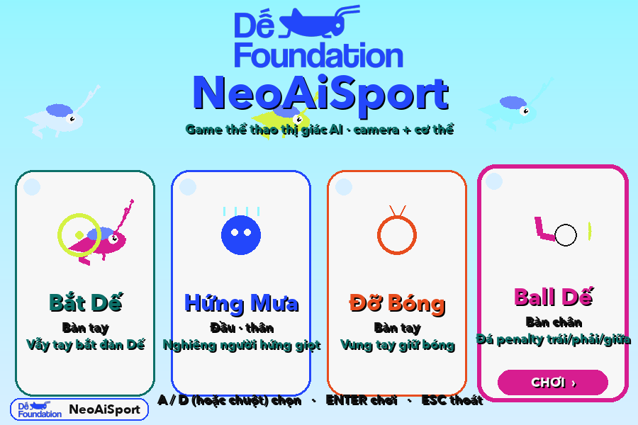
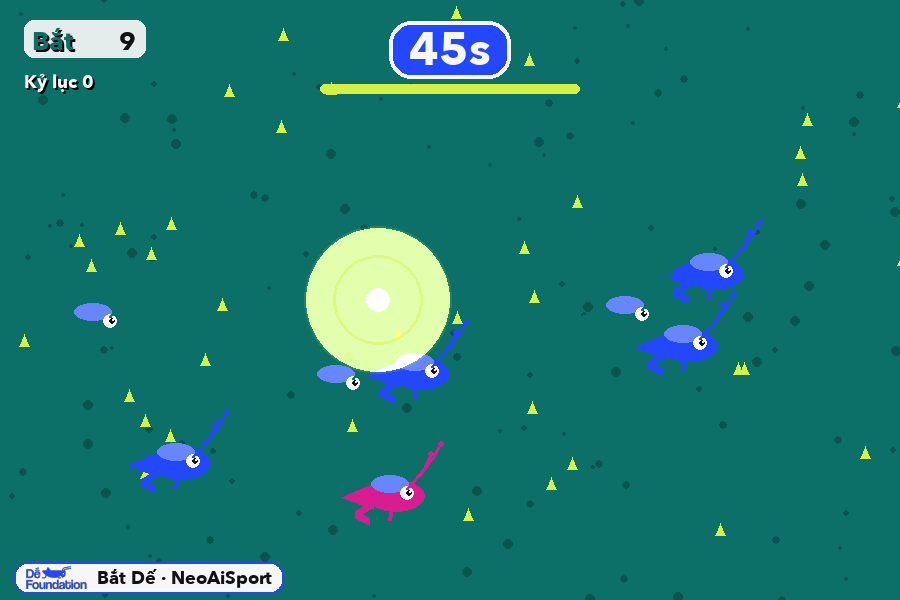
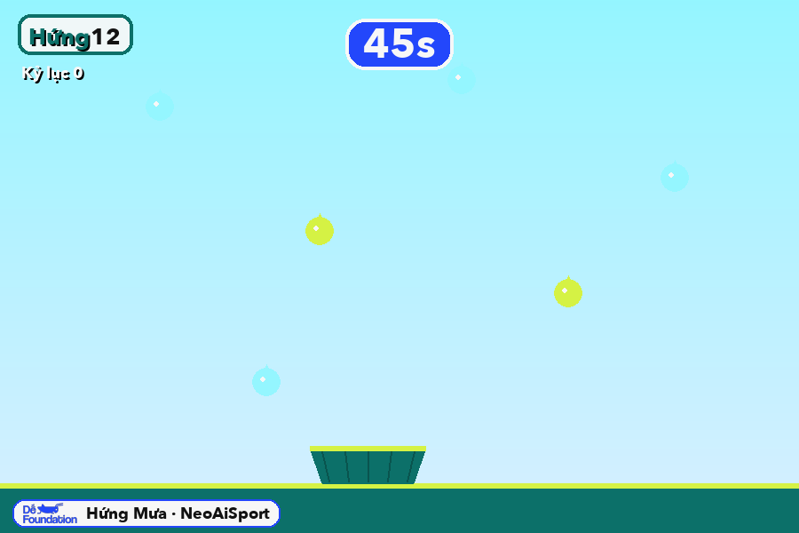
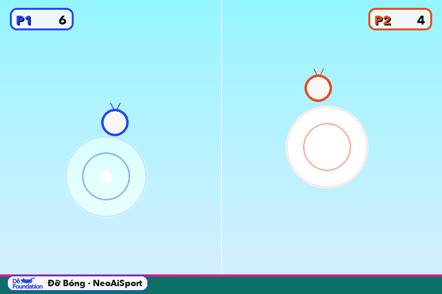
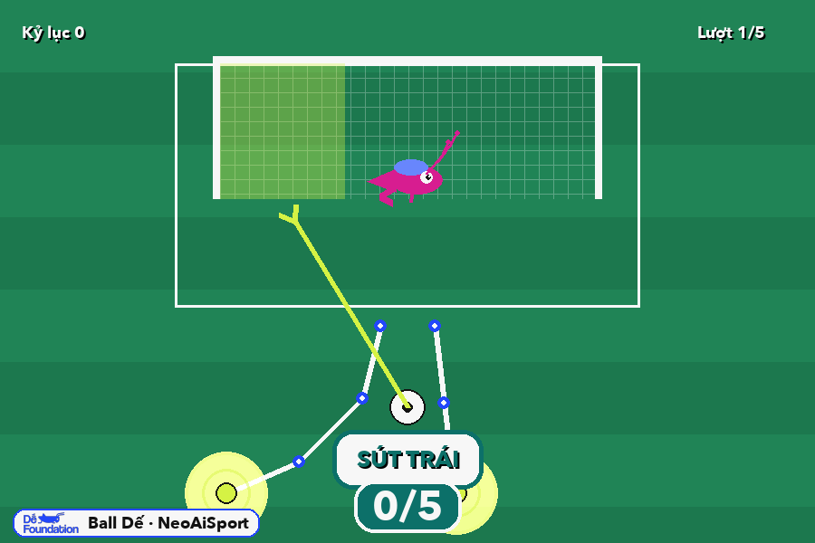

# NeoAiSport

Nền tảng **game thể thao thị giác AI** trên **NEO**: chơi bằng **cơ thể** (bàn tay, cử chỉ,
khuôn mặt, đầu, tư thế) qua **camera** — không cần tay cầm. Cùng vũ trụ **Dế Foundation**
(mascot con Dế) với [NeoArcade](https://github.com/ThingEdu/NeoArcade) & [DeBlue](https://deblue.vercel.app).



> _Khi chơi, nền là **hình webcam** của người chơi; ảnh dưới chụp ở chế độ nền cỏ/sân để thấy rõ phần tử game._

| | |
|---|---|
| **Bắt Dế** — vẫy tay bắt đàn Dế (quầng sáng năng lượng ở tay) | **Hứng Mưa** — nghiêng người, rổ theo bạn hứng giọt |
|  |  |
| **Đỡ Bóng** — đấu 2 người, bóng nảy ở vạch giữa | **Ball Dế** — đá penalty: khung chân + hướng sút |
|  |  |

## Game

| Game | Mô hình AI | Vận động | Trạng thái |
|------|-----------|----------|-----------|
| **Bắt Dế** | HandLandmarker (bàn tay) | vẫy tay bắt đàn Dế | ✅ |
| **Hứng Mưa** | PoseLandmarker (đầu/thân) | nghiêng người hứng giọt | ✅ |
| **Đỡ Bóng** | HandLandmarker (bàn tay) | vung tay giữ bóng trên không | ✅ |
| **Ball Dế** | PoseLandmarker (2 cổ chân) | đá penalty trái/phải/giữa theo hướng chân vung | ✅ |
| Mặt Cười · Cử Chỉ · trò chơi dân gian | Face / Gesture / Pose | biểu cảm, cử chỉ, toàn thân | 💡 |

→ Phân tích & quy hoạch: [`docs/NeoAiSport-Plan.md`](docs/NeoAiSport-Plan.md)

## Chạy

```bash
make install        # đầy đủ (mediapipe + opencv-contrib + pygame)
make install-lean   # gọn cho ARM/NEO: tránh trùng opencv (headless)
make run            # màn tổng — chọn game thị giác (Bắt Dế / Hứng Mưa / Đỡ Bóng)
make run-batde      # Bắt Dế bằng camera
make run-mouse      # Bắt Dế bằng chuột (không cần webcam)
make test           # 26 test engine (4 game)
```
Hoặc: `python -m neoaisport.hub` · `… .batde.app` · `… .huongmua.app` · `… .dobong.app`
(thêm `--source mouse` để chơi bằng chuột khi không có webcam)
Lần đầu macOS hỏi quyền **Camera** → cho phép. (Cảnh báo `Class SDL... in both` chỉ có ở macOS, vô hại.)

## Cấu trúc

```
src/neoaisport/
  config.py            # hằng số + palette Dế Foundation
  vision → input/vision.py  # HandCamera (webcam + MediaPipe HandLandmarker) / MouseHands
  batde/               # Bắt Dế: game.py (thuần) + render.py + app.py
  ui/                  # sprites (con Dế) · widgets · sound  (vendor brand kit)
  storage/db.py        # leaderboard SQLite
  hub.py               # màn tổng chọn game thị giác
  assets/              # logo + hand_landmarker.task (7.5MB, offline)
tests/
```

## Ngăn xếp
Python 3.11+ · pygame-ce · **MediaPipe Tasks** (HandLandmarker; sẽ thêm Pose/Face/Gesture) · OpenCV · SQLite.

> ⚠️ Trên NEO ARM cấu hình thấp: RAM ~228MB (ổn với 2GB); cần verify wheel `mediapipe` aarch64 +
> chế độ ARM (capture 640×480, vision luồng riêng). Xem `docs/NeoAiSport-Plan.md` §5.
